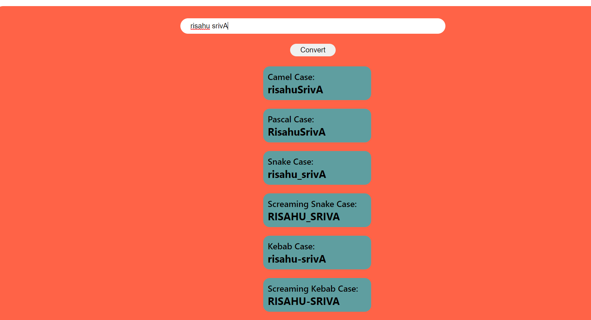

Project-2

# **Project-2** [Live link](https://02javascriptproject.netlify.app/)
 >- Skills gained in this project
 >- Learned about dom manipulation
 >- learned about different types array method slice,join, split,touppercase and tolowercase
 >- learned about how to use map
 
 ***
 **Time taken to finish to this project**
 
 >-It took me 1 hour to complete this project 

 **Screenshot**
 